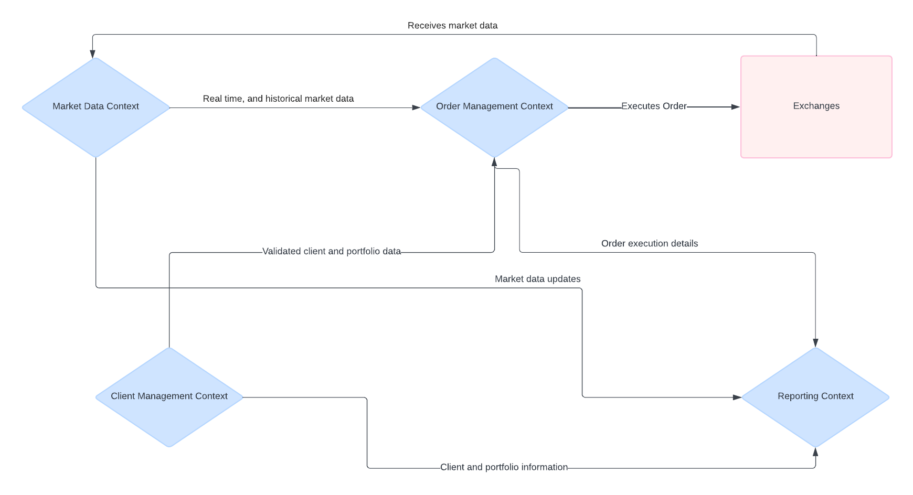

# Joe Trading System

## Bounded Contexts

### User Management Context

#### Responsibilities

1. Manage user information and authentication
2. Handle user registration and validation
3. Maintain user portfolios
4. Provide user self-service functionalities

#### Key Entities

1. User
2. Portfolio

### Order Management Context

#### Responsibilities

1. Validate orders (funds, stock ownership, limit checks)
2. Process orders (apply trading strategies, split orders)
3. Track and manage order status
4. Communicate with exchanges for order execution

#### Key Entities

1. Order
2. Trade
3. Multi-leg Order

### Market Data Context

#### Responsibilities

1. Subscribe to and receive market data updates
2. Provide current market prices and historical data
3. Aggregate and analyze market data for order validation and processing

#### Key Entities

1. Market Data Provider
2. Product Data

### Reporting Context

#### Responsibilities

1. Record and report on trading activities
2. Maintain trade history and order logs
3. Generate regulatory reports
4. Provide administrative reports and system analytics

#### Key Entities

1. Trade History
2. Order Log

### Interactions between Bounded Contexts

#### Client Management Context

1. Sends validated client and portfolio data to Order Management Context for order processing.
2. Provides client information and portfolio details to Reporting Context for generating reports.

#### Order Management Context

1. Receives market data from Market Data Context for order validation and decision making.
2. Sends order execution details to Reporting Context.
3. Communicates with exchanges via REST API for order execution.

#### Market Data Context

1. Provides real-time and historical market data to Order Management Context for validating and processing orders.
2. Sends market data updates to Reporting Context for inclusion in reports.

#### Reporting Context

1. Receives order and trade data from Order Management Context.
2. Collects client and portfolio information from Client Management Context.
3. Incorporates market data from Market Data Context for comprehensive reporting.

### Interaction Diagram

